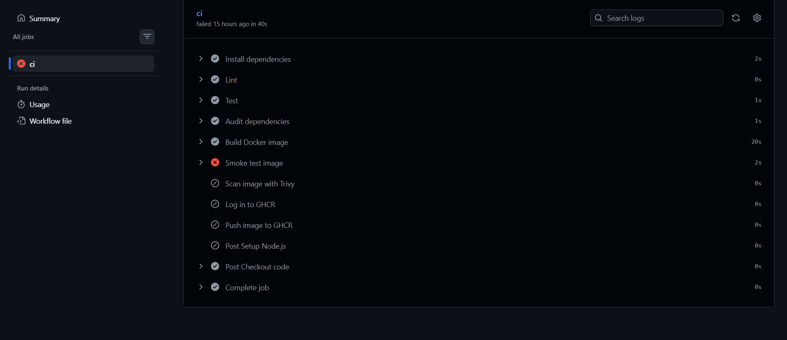
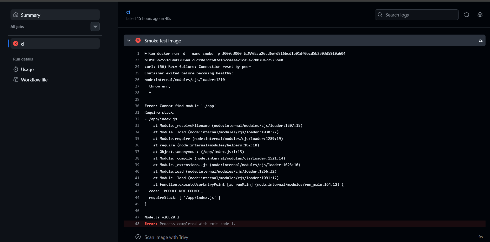

# Phase 6 — Container Registry (GHCR)

## Goal

Give container images a permanent, addressable home so that every green CI run
on `main` produces a versioned image the cluster can pull by name, with no human
in the loop. The image CI tested must be the image the cluster runs.

## Real-world problem being solved

Before this phase the path from code to cluster had two manual, fragile hops:

1. **Phase 3:** `docker save` → `scp` → `k3s ctr images import`. It only works
   with shell access to one node, leaves no record of what is deployed, and
   does not scale to a second node.
2. **Phase 5:** CI uploaded the image as a workflow artifact. Artifacts expire,
   are tied to one run, and nothing in Kubernetes can pull from them.

The result was a broken chain: CI proved an image was good, but that image was
stranded, and the cluster ran a different, hand-built artifact.

## Architecture

```
git push (main)
    │
    ▼
GitHub Actions: lint → test → audit → build → SMOKE TEST → Trivy scan
    │                                                          │
    │   (only on push to main; login uses short-lived GITHUB_TOKEN)
    ▼
ghcr.io/<github-user>/hello-service:<full-commit-sha>   (private package)
    │
    │  kubelet pulls using imagePullSecret "ghcr-pull-secret"
    ▼
k3s (idp-k3s-node)  ←  helm upgrade (image.tag = commit SHA)
```

## Why each design decision

| Decision | Choice | Why |
|---|---|---|
| Registry | GHCR | Free at this scale, next to the code, no extra service on an 8GB host (ADR-005) |
| Visibility | Private | Application images are private in most organizations; also better evidence than "made it public so it works" |
| Tags | Full commit SHA only, no `latest` | Traceable, immutable by convention; GitOps diffs and rollbacks stay meaningful (needed for Phase 7) |
| CI auth | `GITHUB_TOKEN`, job-level `packages: write` | Short-lived, no stored push credential; least privilege via workflow-level `contents: read` default |
| Push gate | `push` to `main` only | PRs build, test and scan but never get registry write access |
| Cluster auth | `imagePullSecret` from a classic PAT with only `read:packages` | GHCR supports classic PATs only; read-only, 30–90 day expiry, created by hand, never committed |
| Action pinning | `docker/login-action` pinned to a commit SHA verified with `git ls-remote` | Lesson from the Phase 5 Trivy supply-chain incident |

## Implementation (summary)

1. **CI → GHCR.** Added `permissions`, an `IMAGE` env var built from
   `github.repository_owner`, OCI `source` and `revision` labels on the image,
   a SHA-pinned `docker/login-action` (v4.6.0), and a push step, both gated to
   pushes on `main`. Removed the tarball and artifact-upload steps.
2. **Package visibility.** The first published package came out **public**
   (see troubleshooting) and was switched to private in the package settings.
3. **Cluster credential.** Created a classic PAT with only `read:packages`.
   Created the Secret on the VM with `read -s` so the token never touched shell
   history or a file, and proved it with a direct `crictl pull` before involving Helm:
   ```bash
   kubectl create secret docker-registry ghcr-pull-secret \
     --docker-server=ghcr.io --docker-username="$GH_USER" \
     --docker-password="$GH_TOKEN" -n default
   ```
4. **Helm chart.** Added `imagePullSecrets` support (rendered only when the list
   is non-empty, so the chart still works for public images), switched the
   repository to GHCR, set the tag to a commit SHA and `pullPolicy` from `Never`
   to `IfNotPresent`.
5. **Fix and smoke test.** Fixed the Dockerfile, then added a CI step that runs
   the built image and polls `/healthz` before scan, login and push.
6. **Node cleanup.** Removed the Phase 3 hand-imported image and the broken image.

## Troubleshooting journey

### 1. The package was public, not private
I expected a new package to default to private. A package published by a
workflow with `GITHUB_TOKEN` instead **inherits the visibility of its source
repo**, and the repo is public. The `org.opencontainers.image.source` label
links the package to the repo, which is what makes it inherit. Switched it to
private in package settings (Danger Zone → Change visibility).
**Lesson:** verify defaults instead of assuming them.

### 2. The CI-built image crash-looped: `Cannot find module './app'`
First real deploy of the CI image: the pod showed `Running` but `0/1` with
repeated restarts. `kubectl logs --previous` showed:

```
Error: Cannot find module './app'
Require stack:
- /app/index.js
```

Root cause: the Phase 5 refactor split `index.js` into `app.js` + `index.js`,
but the Dockerfile still had `COPY package.json index.js ./` from Phase 2, so
`app.js` was never in the image. Fix: `COPY package.json index.js app.js ./`.
The rolling update kept the old pod serving the whole time, so there was no
downtime. Rollout evidence: Helm revision 2 was the broken image, revision 3 the fix.

**Why CI missed it:** lint and tests run against the source tree where `app.js`
exists, `docker build` cannot fail on a missing file it was never asked to
copy, and Trivy only inspects packages. Nothing ever *started* the container.
That led directly to the smoke test below.

### 3. Smoke test added and proven to fail on the real bug
The new step runs the freshly built image, polls `/healthz` for up to 30s, and
prints the container logs and fails if it crashes or never answers. It runs
before login and push, so a broken image can no longer reach GHCR.
To prove it works, a throwaway branch reverted the `COPY` line and was opened as
a PR (never merged): the run went red at "Smoke test image" with
`Cannot find module './app'` in the log, and the login and push steps were skipped.

   - PR: [hello-service #1 (closed, not merged)](https://github.com/kanishkatyagi2/hello-service/pull/1)
- Screenshot (pipeline stopped at the smoke test, push steps skipped):
  
- Screenshot (failing step log):
  

### 4. First pull failed with a DNS error, then self-healed
Events on the new pod:

```
Warning  Failed  kubelet  Failed to pull image "ghcr.io/<github-user>/hello-service:3ec2...":
  ... failed to do request: Head "https://ghcr.io/v2/...": dial tcp: lookup ghcr.io: Try again
Normal   Pulling  kubelet  Pulling image ".../hello-service:3ec2..."
Normal   Pulled   kubelet  Successfully pulled image ... in 8.207s ... Image size: 49110155 bytes.
```

The failure was name resolution (`lookup ghcr.io: Try again`), not credentials:
the request never reached the registry. Kubernetes retried after back-off and
the pull succeeded. Treated as transient; if it recurs, investigate the VM's resolver.

### 5. Seven restarts over about eight hours: probable laptop sleep
Hours after the deploy the pod showed `1/1 Running` with 7 restarts, last container
state `Terminated, Error, exit code 137` (SIGKILL), not `OOMKilled`. Events
showed kubelet timeouts retrieving the pull secret and mounting a ConfigMap
(`FailedToRetrieveImagePullSecret`, `FailedMount`), probe failures of every kind
(`connection refused`, `connection reset by peer`, `context deadline exceeded`),
and a `Killing` event after a failed liveness probe.

Assessment: **consistent with the host laptop going to sleep**, which freezes the
VM and stalls the kubelet and probes. This is an artifact of running k3s on a laptop,
not an app defect. It is a diagnosis from circumstantial evidence, not a proven
one; the restart count staying flat while the laptop stays awake is the confirmation.
Hardening items are logged below.

## Verification steps & actual output

Direct pull with the read-only credential, before any Helm change:
```
$ sudo k3s crictl images | grep hello-service
ghcr.io/<github-user>/hello-service   cb79f97276101cd6a96a24c1defda57367ba97a1   24063bf3b9210   49.1MB
```

Final deploy (revision 3):
```
$ kubectl rollout status deploy/hello-service
deployment "hello-service" successfully rolled out

$ kubectl get pods
hello-service-df4846dc8-p8tkm   1/1   Running   0   69s

$ kubectl logs deploy/hello-service
hello-service listening on port 3000

$ helm history hello-service
1   Mon Sep 14 10:32:19 2026   superseded   service-chart-0.1.0   Install complete
2   Sun Oct  4 10:48:22 2026   superseded   service-chart-0.1.0   Upgrade complete   (broken image)
3   Sun Oct  4 11:15:35 2026   deployed     service-chart-0.1.0   Upgrade complete

$ curl -s http://192.168.68.10:30080
{"service":"hello-service","message":"Hello from the golden path","version":"0.1.0"}
```

Final node state: one `hello-service` image remains, tagged
`3ec24560928b28caf85f506c1fa6166ac2f69d35`.

## Resource evidence (ADR-005)

This phase adds no cluster workloads: the registry is external. Disk and RAM
were checked before and after each step.

| Step | Disk used / avail (before → after) | RAM used (before → after) | RAM available |
|---|---|---|---|
| Pull secret + direct image pull | 7.8G / 9.9G → 7.8G / 9.8G | 1.0Gi → 1.0Gi | 1.6Gi → 1.6Gi |
| `helm upgrade` to fixed image | 7.8G / 9.9G → 7.8G / 9.9G | 1.1Gi → 1.0Gi | 1.5Gi → 1.5Gi |
| Remove old images | 7.9G / 9.8G → 7.8G / 9.8G | 1.1Gi → 1.1Gi | 1.5Gi → 1.5Gi |

Read RAM from the **available** column, not **free**: free reads very low
(for example 91Mi) because Linux uses spare memory for page cache, but available
stayed at about 1.5Gi throughout. Disk deltas are tiny because image layers are
shared with the Alpine base.

## How this maps to real industry practice

- **Registry + immutable, commit-traceable tags** is the standard artifact flow:
  build once, promote the same image through environments. Equivalents are ECR,
  GCR/Artifact Registry, ACR, Harbor, Docker Hub.
- **Short-lived CI credentials** (`GITHUB_TOKEN`, or OIDC federation to a cloud
  registry) are preferred over stored push tokens.
- **`imagePullSecret`** is the baseline cluster-side pattern. Managed clusters
  usually replace it with node or workload identity (for example IAM roles for ECR).
- **Smoke tests before publish** are the first rung of "shift left": never publish
  an artifact that has not been started at least once.
- **Rolling updates** are what kept the broken revision from causing downtime.

## What was committed

`hello-service`:
- `.github/workflows/ci.yml`: GHCR push (gated to `main`), permissions, OCI labels, smoke test
- `dockerfile`: `COPY package.json index.js app.js ./`

`internal-developer-platform`:
- `helm/service-chart/values.yaml`, `helm/service-chart/templates/deployment.yaml`: GHCR image, `imagePullSecrets`
- `docs/adr/006-container-registry-ghcr.md`, this document, README status

**Not committed, by design:** the pull Secret and the PAT. They exist only in the cluster.

## Portfolio evidence

- Green Actions run with login and push steps executed
- Package page showing the private package with SHA tags and the repo link
- Pod events showing `Pulling` → `Successfully pulled` from the private registry
- Failed PR run at the smoke-test step (screenshot + closed PR link)
- Helm history showing the broken revision and the fix
- Before/after `df`/`free` for each step

## Known limitations and hardening backlog

- **Pull token is personal and expires.** A machine account or GitHub App, plus
  rotation, would replace it in an organization. Revisit in Phase 11 (Secrets).
- **Tags are immutable by convention.** Pin by image digest for enforcement.
- **Other GitHub Actions use mutable tags** (`checkout`, `setup-node`). Pin by SHA.
- **Trivy is still report-only.** Make it blocking once findings are triaged.
- **Rename `dockerfile` to `Dockerfile`** (needs `git mv` on Windows).
- **Probes:** add a `startupProbe` and more forgiving timings so a stalled node
  or slow cold start does not trigger kills.
- **Graceful shutdown:** Node as PID 1 ignores SIGTERM by default, so stops
  wait out the 30s grace period. Add a signal handler or use `tini`.
- **Laptop sleep** stalls the VM; shut the VM down cleanly or save its state.
